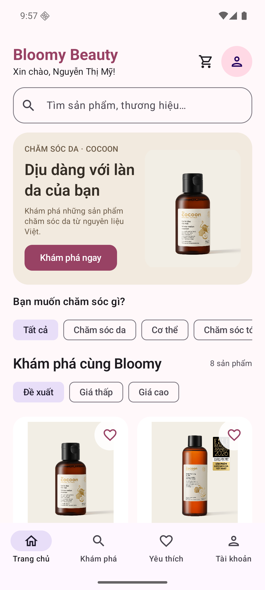
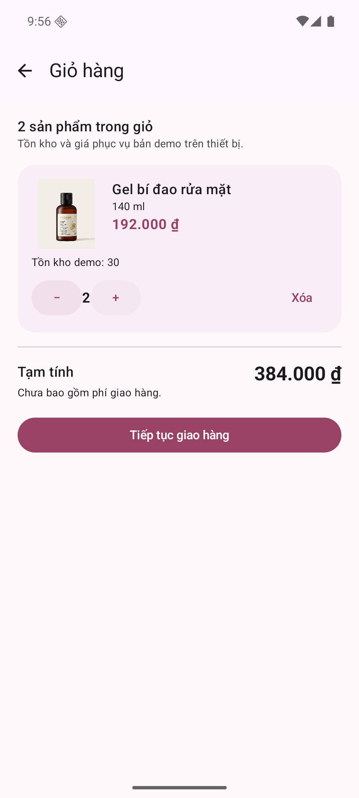
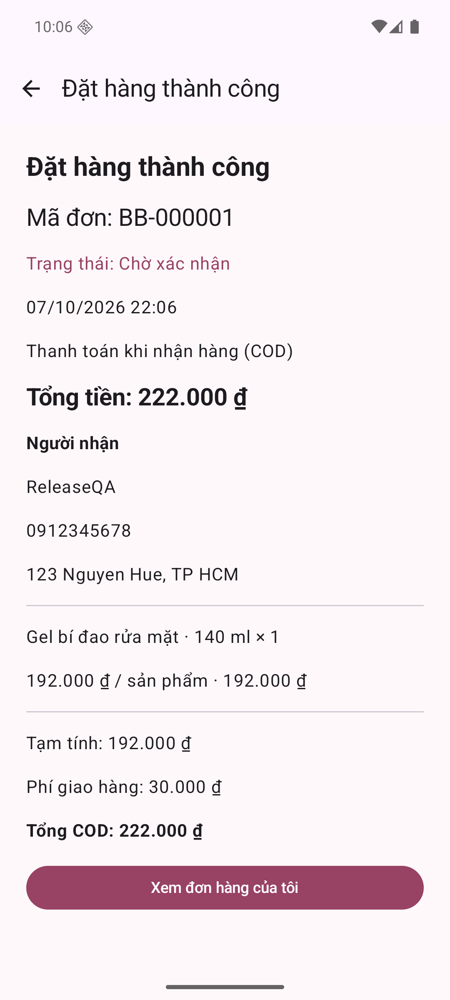
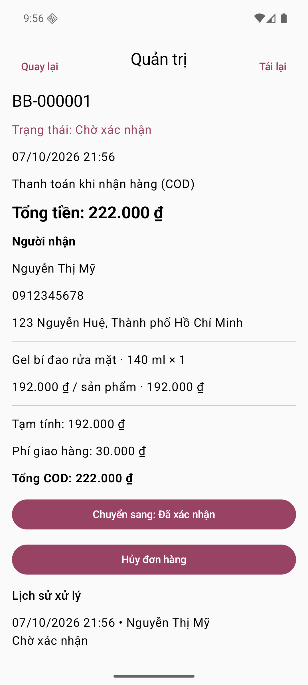
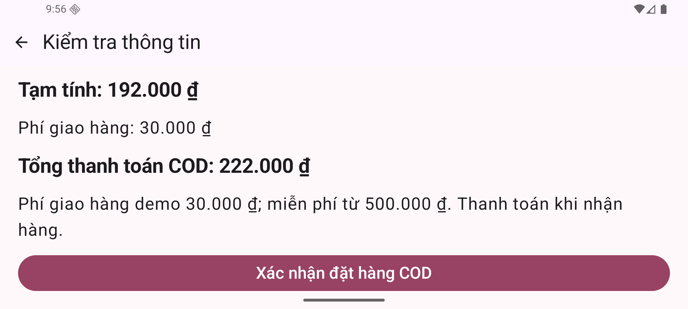

# ỨNG DỤNG BÁN MỸ PHẨM — BLOOMY BEAUTY

**Báo cáo đồ án Lập trình di động**  
Phiên bản tài liệu: 08/10/2026 — ứng dụng 1.0, SQLite schema 5.

| Thông tin | Nội dung cần điền |
|---|---|
| Trường/khoa | [Điền theo mẫu của học phần] |
| Lớp/học phần | [Điền tên lớp và mã học phần] |
| Giảng viên hướng dẫn | [Điền họ tên] |
| Nhóm | [Điền số/tên nhóm] |
| Thành viên | [Họ tên — MSSV từng thành viên] |
| Ngày bảo vệ | [Điền ngày thực tế] |

Thông tin tác giả và phân công chưa được cung cấp; báo cáo không tự suy diễn đóng góp của thành viên. Bản hiện tại là báo cáo kỹ thuật có thể hoàn thiện theo biểu mẫu học phần.

## Tóm tắt

Bloomy Beauty là ứng dụng Android mô phỏng mua mỹ phẩm: đăng ký/đăng nhập, xem và tìm sản phẩm, yêu thích, giỏ hàng, lưu giao hàng, đặt COD, lịch sử/hủy đơn và quản trị sản phẩm/đơn. Giao diện dùng Kotlin/Jetpack Compose, dữ liệu dùng SQLiteOpenHelper trên một thiết bị. Tám sản phẩm và ảnh tham khảo Cocoon được đóng gói để dùng ngoại tuyến; giá là dữ liệu thu thập ngày 07/10/2026, tồn 30 đơn vị ban đầu là dữ liệu demo.

Các điểm đã kiểm chứng gồm phân quyền Repository theo phiên, snapshot đơn, transaction trừ/hoàn tồn, mã yêu cầu chống trùng, revision chống ghi đè tồn và khôi phục sau commit. Kết quả Phase 12: 24 ca JVM và 81 ca Android đạt trên API 36. Chưa có backend, đồng bộ thiết bị, thanh toán online hoặc kiểm chứng runtime API 28. Gói trình diễn `.demo` và gói release QA `.qa` có dữ liệu riêng.

## 1. Bài toán và mục tiêu

Một luồng mua hàng cần cho khách tìm được sản phẩm, biết số tiền phải trả, xác nhận địa chỉ và xem tiến độ xử lý. Quản trị cần cập nhật thông tin bán hàng và xử lý đơn mà vẫn giữ lịch sử mua trước đó. Nếu chỉ nối màn hình, những tình huống đổi giá, thiếu tồn, bấm đặt/hủy nhiều lần hoặc đổi tài khoản có thể tạo đơn/tồn sai.

Mục tiêu của đồ án là triển khai một luồng hoàn chỉnh có thể chạy lại trên Android và giải thích được cách dữ liệu thay đổi. SQLite được chọn theo yêu cầu triển khai của đề tài để học cơ chế lưu trữ, truy vấn tham số, migration và transaction. Kết quả được đánh giá bằng hành vi trên giao diện, kiểm thử Repository và dữ liệu sau giao dịch.

Phạm vi gồm khách hàng và quản trị viên lần lượt đăng nhập trên cùng thiết bị. Đơn COD chỉ được ghi vào database nội bộ. Ứng dụng không đại diện cho thương hiệu tham khảo, không nhận thanh toán và không gửi đơn đến cửa hàng thật.

## 2. Khảo sát yêu cầu

| Vai trò | Chức năng đã triển khai | Điều kiện chính |
|---|---|---|
| Chưa đăng nhập | Đăng ký, đăng nhập | Kiểm tra tên/email/mật khẩu/xác nhận; email duy nhất |
| Khách | Danh mục, tìm/lọc/sắp xếp, yêu thích | Yêu thích theo tài khoản; tìm bỏ dấu tiếng Việt |
| Khách | Giỏ, địa chỉ giao hàng | Số lượng 1–99, không vượt tồn, không mua sản phẩm ẩn |
| Khách | Kiểm tra, xác nhận COD, lịch sử | Chỉ thao tác dữ liệu đúng phiên; đơn lưu snapshot |
| Khách | Hủy đơn | Là chủ đơn và đơn đang PENDING |
| Quản trị | Thêm/sửa/ẩn/mở sản phẩm | Vai trò ADMIN hiện hành; revision khớp khi sửa |
| Quản trị | Xác nhận/giao/hủy đơn, xem lịch sử | Đúng bảng trạng thái; transaction và audit |

Yêu cầu phi chức năng: giữ dấu và con trỏ khi nhập tiếng Việt; giữ trạng thái khi tái tạo Activity; tải SQLite ở Dispatchers.IO; đóng gói ảnh ngoại tuyến; thông báo lỗi thao tác; tiền nguyên VND có kiểm tra tràn; không lưu mật khẩu rõ trong database. Các yêu cầu nhiều thiết bị và backend được tách thành hướng phát triển.

Sơ đồ use case, dữ liệu và trình tự ở [tài liệu sơ đồ](so-do.md), cùng các SVG ngoại tuyến trong thư mục `so-do/`.

## 3. Công nghệ và kiến trúc

| Thành phần | Cấu hình của mã nguồn |
|---|---|
| Ngôn ngữ/giao diện | Kotlin 2.0.21, Jetpack Compose, Material 3 |
| Công cụ build | Android Gradle Plugin 8.9.1, Gradle wrapper của dự án |
| Android | compile/target SDK 35, min SDK 28 |
| Dữ liệu | Android SQLiteOpenHelper, database schema version 5 |
| Trạng thái | ViewModel, StateFlow, collectAsStateWithLifecycle |
| Công việc nền | Kotlin coroutines / Dispatchers.IO |
| Kiểm thử | JUnit, Android instrumentation, Compose UI test |

Màn hình Compose gửi thao tác tới ViewModel. ViewModel cập nhật trạng thái màn hình và gọi Repository. Repository giữ truy vấn, kiểm tra phiên/điều kiện nghiệp vụ và transaction. SQLiteOpenHelper tạo/migrate database; hình ảnh và nguồn sản phẩm nằm trong resource/seed.

`BloomyApp` là màn hình gốc dùng chung giữa ứng dụng và kiểm thử tích hợp. Điều hướng hiện tại gồm HOME/CART/ORDERS/PROFILE/ADMIN, lưu tên màn hình và dùng SaveableStateHolder. AuthViewModel sở hữu ViewModelStore của phiên. Store còn qua thay đổi cấu hình nhưng được xóa sau đăng xuất thành công; cùng người đăng nhập lại nhận ViewModel mới. Trạng thái đang nhập trong hồ sơ không bị resume tự tải đè.

Cấu trúc thực tế: `data/auth`, `data/catalog`, `data/cart`, `data/order`, `data/profile`, `data/admin`; `feature/auth`, `feature/home`, `feature/cart`, `feature/order`, `feature/profile`, `feature/admin`, `feature/app`; `ui/theme`. Không có backend riêng trong bản này.

## 4. Thiết kế dữ liệu SQLite

| Bảng | Khóa và dữ liệu tiêu biểu | Vai trò |
|---|---|---|
| users | `_id`, email UNIQUE, name, hash/salt/iterations, role | Tài khoản và vai trò CUSTOMER/ADMIN |
| auth_session | `_id=1`, user_id FK | Một phiên hiện hành trên thiết bị |
| categories | id, name, sort_order | Nhóm sản phẩm |
| products | id, category_id, giá, tồn, active, revision, thông tin/ảnh/nguồn | Danh mục và kho cục bộ |
| favorites | `(user_id, product_id)` | Yêu thích không trùng |
| cart_items | `(user_id, product_id)`, quantity, accepted_price_vnd | Giỏ và giá khách đã thấy |
| shipping_details | user_id PK, recipient, phone, address | Địa chỉ mặc định/checkout |
| checkout_requests | request_id PK, user_id UNIQUE, fingerprint, payload | Yêu cầu đã lưu trước xác nhận |
| orders | `_id`, user_id, request_id UNIQUE, fingerprint, status, tiền/địa chỉ snapshot | Đơn và chống trùng |
| order_items | `(order_id, product_id)`, tên/dung tích/ảnh/giá/số lượng snapshot | Chi tiết mua không đổi theo danh mục |
| order_events | `_id`, order_id, actor_id/name, trạng thái trước/sau, thời gian | Lịch sử quản trị/đơn |

Khóa ngoại được bật trong onConfigure. Các CHECK chặn số lượng ngoài 1–99, tồn/tiền âm, vai trò/trạng thái không hợp lệ. Chỉ mục đơn theo người dùng và thời gian hỗ trợ lịch sử. UNIQUE request_id là lớp bảo vệ dữ liệu cuối cùng chống tạo đơn lặp.

Migration giữ dữ liệu cũ: v1 tài khoản/phiên; v2 danh mục/yêu thích; v3 giỏ/giao hàng/tồn; v4 yêu cầu/đơn/chi tiết; v5 role/revision/audit. Vai trò dữ liệu cũ mặc định CUSTOMER. Kiểm thử Android chạy migration từ v1, v2, v3, v4 lên v5. Không dùng xóa database làm cách migration.

## 5. Triển khai chức năng

### 5.1. Đăng ký, phiên và quyền

Đăng ký kiểm tra tên 2–80 ký tự, email hợp lệ, mật khẩu 8–128 ký tự không chỉ khoảng trắng và xác nhận khớp. Email dùng truy vấn tham số và ràng buộc UNIQUE. PasswordHasher dùng PBKDF2-HMAC-SHA256, 210.000 vòng, salt ngẫu nhiên 16 byte và đầu ra 256 bit; kiểm tra hash bằng MessageDigest.isEqual. Database không lưu mật khẩu rõ.

Mọi API dữ liệu riêng đối chiếu userId với auth_session trong transaction. Khách B truyền ID A bị từ chối; khi B dùng ID của mình để đọc ID đơn A, kết quả là null. AdminRepository đọc vai trò ADMIN từ database và phiên hiện tại mỗi lần. Thu hồi quyền có hiệu lực ở lần gọi tiếp theo, dù giao diện đã mở.

Bootstrap admin chỉ áp dụng build debug và chỉ tạo email chưa tồn tại. Không nâng quyền khách hoặc đặt lại mật khẩu tài khoản đã có. Gói `.demo` dùng cấu hình công khai riêng; bản debug gốc dùng cấu hình admin ngẫu nhiên cục bộ; release không seed admin.

### 5.2. Danh mục, yêu thích và giỏ

Danh mục gồm 8 sản phẩm thật được tóm tắt thông tin/giá tham khảo, với ảnh lưu trong drawable-nodpi. Tìm kiếm bỏ dấu và không phân biệt hoa/thường; lọc danh mục, sắp xếp giá tăng/giảm; yêu thích theo phiên. Giỏ lưu số lượng và accepted_price_vnd. Sản phẩm hết hàng/ẩn/missing không thêm được.

Khi giá thay đổi, giỏ hiển thị giá cũ/mới và yêu cầu xác nhận. Tồn giảm cần giảm số lượng; sản phẩm ẩn cần xóa. Giá và tồn được kiểm tra lại trong transaction khi xác nhận đơn, không chỉ dựa vào giao diện.

### 5.3. Giao hàng và COD

Người nhận 2–80 ký tự, địa chỉ 10–300 ký tự, điện thoại di động Việt Nam 10 chữ số; +84/84 được chuẩn hóa về 0. Tạm tính là tổng đơn giá × số lượng. Phí giao hàng demo 30.000 ₫, miễn phí khi tạm tính ≥500.000 ₫. Tiền dùng Long/Math.addExact/multiplyExact để chặn tràn thay vì âm thầm cho số sai.

Khách lưu giao hàng và kiểm tra đơn trước khi xác nhận. Repository tạo requestId UUID và fingerprint SHA-256 từ các trường có tiền tố độ dài, sắp dòng theo productId. Yêu cầu được lưu trong SQLite trước commit, giữ cùng mã khi thử lại cùng nội dung.

Tạo đơn diễn ra trong transaction: kiểm tra phiên → tra request đã có → kiểm tra fingerprint → kiểm tra giỏ/địa chỉ/giá/tồn → trừ tồn và tăng revision → ghi đơn/chi tiết/audit → dọn giỏ của lần đặt → commit. Thiếu tồn hoặc lỗi ghi bất kỳ dòng nào rollback mọi thay đổi. Khi request đã thành công, trả lại đơn cũ trước khi đụng vào giỏ mới.

### 5.4. Hủy và xử lý đơn

| Từ | Đến | Người thao tác | Tác động tồn |
|---|---|---|---|
| Chưa có | PENDING | Khách tạo COD | Trừ một lần |
| PENDING | CONFIRMED | Admin | Không đổi |
| PENDING | CANCELLED | Chủ đơn hoặc admin | Hoàn một lần |
| CONFIRMED | SHIPPING | Admin | Không đổi |
| CONFIRMED | CANCELLED | Admin | Hoàn một lần |
| SHIPPING | DELIVERED | Admin | Không đổi |
| DELIVERED/CANCELLED | Không chuyển tiếp | Không | Không đổi |

Admin kiểm tra trạng thái kỳ vọng và trạng thái đích. Gửi lại cùng chuyển đã hoàn tất không tạo audit/trừ hoặc hoàn lần nữa. Hủy cập nhật trạng thái, hoàn tồn, tăng revision và ghi audit trong một transaction. Bản sửa sản phẩm có revision cũ sau đặt/hủy bị từ chối để không ghi đè tồn mới.

### 5.5. Vòng đời và khôi phục

Tái tạo Activity giữ ViewModel phiên, bản nháp và màn hình. Khi resume, danh mục/giỏ tải lại; nếu đang review và dữ liệu không còn khớp, quay về giỏ để sửa. Bước giao hàng giữ bản nháp, không nhảy sang yêu cầu cũ.

Khi mất toàn bộ ViewModel hoặc tiến trình bị force-stop, session/giỏ/request/result đọc lại từ SQLite. Request chưa commit khôi phục review; request đã commit khôi phục đúng đơn. Bản nháp giao hàng chưa lưu chỉ được giữ qua tái tạo cấu hình, không được hứa giữ sau mọi lần tiến trình kết thúc.

Database được loại khỏi cloud/device backup qua hai XML rule. Đó là cấu hình build đã kiểm tra, chưa có thử chuyển thiết bị thật. Dữ liệu local mất khi gỡ/xóa app; chưa mã hóa database hoặc đồng bộ tài khoản.

## 6. Giao diện và minh chứng

Hình 1. Danh mục, tìm kiếm, nhóm sản phẩm và điều hướng tài khoản.

Hình 2. Giỏ hàng theo tài khoản, số lượng và tiền nguyên VND.

Hình 3. Đơn COD BB-000001 khôi phục sau force-stop APK release QA.

Hình 4. Quản trị xử lý trạng thái và lịch sử. Đây là ảnh nghiệm thu debug; release QA không có admin tự tạo.

Hình 5. Activity ngang và chữ Compose 150%; có thể cuộn tới hành động xác nhận/kết quả.

## 7. Kết quả kiểm thử

Ngày 07/10/2026: 24 JVM + 81 Android = **105 ca đạt**, không bỏ qua, trên Pixel 6/API 36. Build/lint debug và release thành công. Lint debug 45 warning + 1 information; release 23 warning + 1 information; 0 error. Ma trận 24 dòng và các ca đạt/một phần/chưa áp dụng ghi ở [kế hoạch, mục 23.4](../ke-hoach-de-tai.md#234-kết-quả-nghiệm-thu).

Các nhóm chính: validation/hash/truy vấn tham số; đổi phiên/truy cập chéo; tìm/lọc/yêu thích; giỏ/địa chỉ; giá/tồn đổi; rollback lỗi giữa nhiều dòng; 8 retry đồng thời; fingerprint sai; hủy lặp/race; snapshot/revision/audit; migration; tiếng Việt; điều hướng/tái tạo; cold start/new ViewModel; ngang/chữ lớn.

Release QA được cài riêng và thao tác ngoài instrumentation: đăng ký → giỏ 1 sản phẩm → force-stop/mở lại giữ phiên/giỏ → lưu giao hàng → force-stop khôi phục review → đặt BB-000001 tổng 222.000 ₫ → force-stop khôi phục thành công → lịch sử 1 đơn/tồn 29. Ca nhiều khách tồn 1 hiện theo phiên lần lượt trên cùng thiết bị; không coi là kiểm thử hai thiết bị đồng thời.

APK `.demo` của Phase 13 thêm package/config debug riêng để bàn giao tài khoản công khai; không thay nghiệp vụ. Kết quả diễn tập trực tiếp của APK này được cập nhật trong kế hoạch mục 24. Không gọi 105 ca là connected tests chạy trên APK `.demo` nếu chúng chạy trên gói debug gốc.

## 8. Hạn chế và hướng phát triển

API 28 là min SDK khai báo nhưng chưa chạy emulator/API 28; thiết bị nộp thực tế còn cần nghiệm thu. APK trình diễn ký debug, release thường chưa có khóa ký chính thức. Thông tin thành viên/lớp/giảng viên, phân công và ngày bảo vệ còn chờ điền.

SQLite một thiết bị không cung cấp danh tính/ủy quyền tin cậy cho cửa hàng nhiều thiết bị. Bảo vệ Repository không chống root/sửa database trực tiếp. Chưa có backend, Security Rules, đồng bộ kho, online payment, remote image upload, thông báo hoặc đánh giá. Giá tham khảo không cập nhật theo cửa hàng; tồn và mọi đơn là dữ liệu demo.

Hướng phát triển: backend có xác thực và quyền server; giao dịch/khóa chống trùng phía server; đồng bộ thay đổi kho; kiểm thử mất phản hồi mạng; cổng thanh toán sandbox; ảnh có kiểm tra quyền; kiểm thử thiết bị Android tối thiểu và kiểm thử backup thực tế. Không dùng các phần dự kiến này để mô tả chức năng đã có.

## 9. Kết luận

Đồ án đã triển khai luồng khách–quản trị trên Android với SQLite, từ xác thực đến đặt/hủy và xử lý đơn. Trọng tâm kỹ thuật là tính đúng của tiền/tồn/quyền qua transaction, dữ liệu snapshot, fingerprint và revision. Bộ kiểm thử và kịch bản cold start cung cấp bằng chứng cho phạm vi chạy trên API 36. Các bước nghiệm thu thiết bị, ký phát hành và hoàn thiện thông tin học phần cần thực hiện trước khi nộp chính thức.

## 10. Tài liệu tham khảo

- [Android: lưu trữ với SQLite](https://developer.android.com/training/data-storage/sqlite).
- [Android Auto Backup](https://developer.android.com/identity/data/autobackup).
- [Android: build bằng dòng lệnh](https://developer.android.com/build/building-cmdline).
- [Nguồn sản phẩm/ảnh Cocoon theo từng trang](../product-sources.md), thu thập 07/10/2026.
- Mã nguồn trong `app/src/main/`, các fixture trong `app/src/androidTest/` và `app/src/test/` của bản bàn giao.

## Phụ lục A. Phân công thực tế

| Thành viên/MSSV | Phần việc đã thực hiện | Bằng chứng file/commit/biên bản | Người xác nhận |
|---|---|---|---|
| [Điền] | [Điền đóng góp thực tế] | [Điền] | [Điền] |
| [Điền nếu có] | [Điền đóng góp thực tế] | [Điền] | [Điền] |

Không quy các phần được hỗ trợ tự động cho một thành viên nếu chưa xác nhận. Workspace hiện không có repository Git; manifest SHA-256 xác định tập file bàn giao, không thay thế lịch sử đóng góp.
