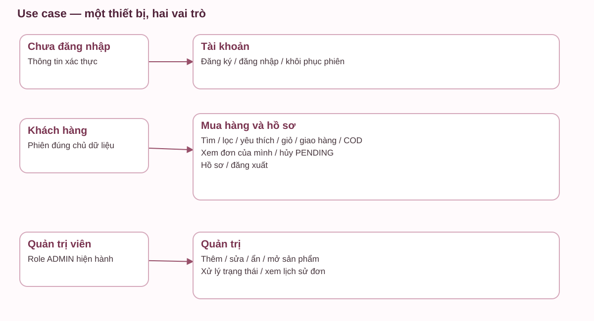
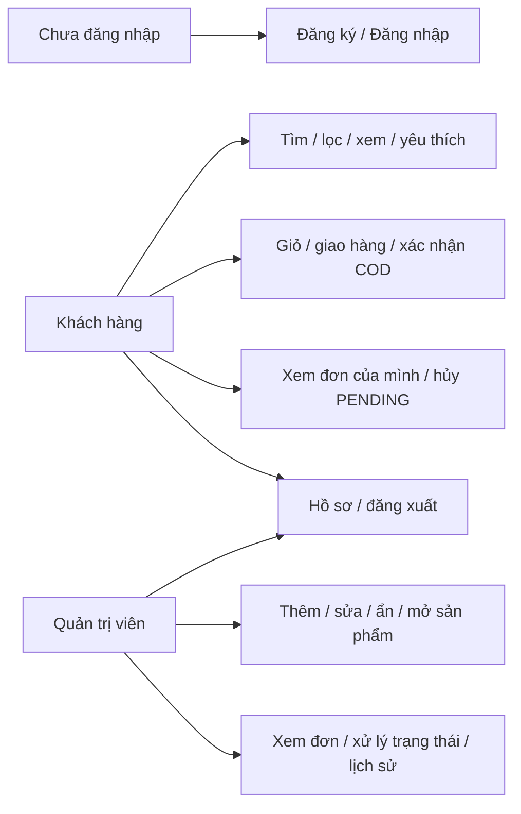
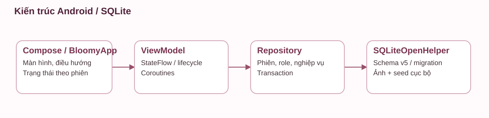
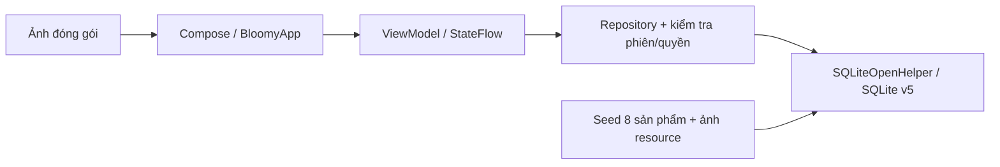
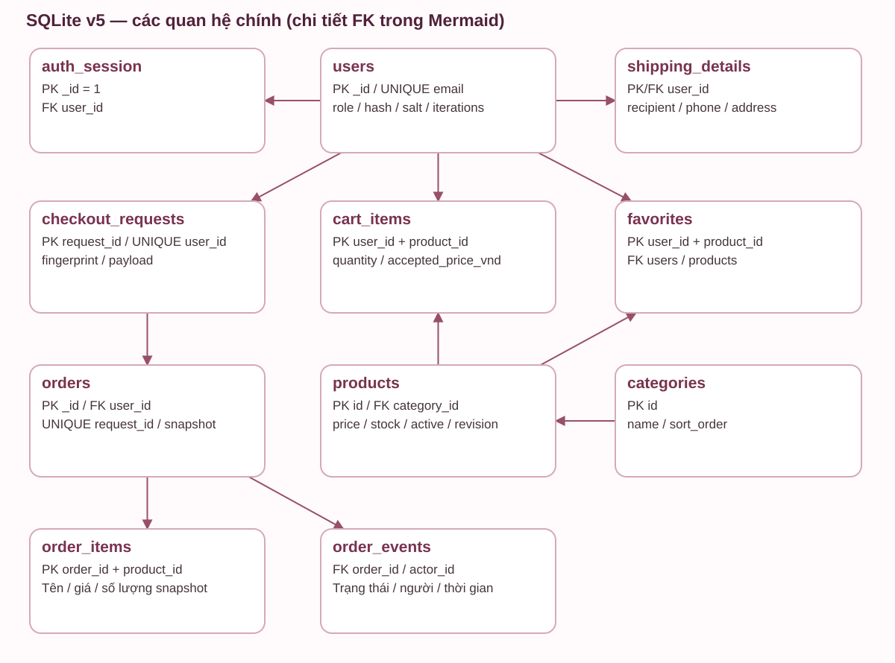
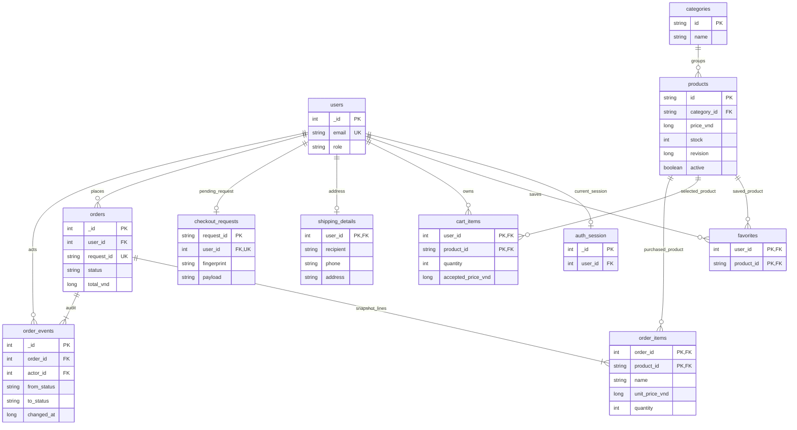
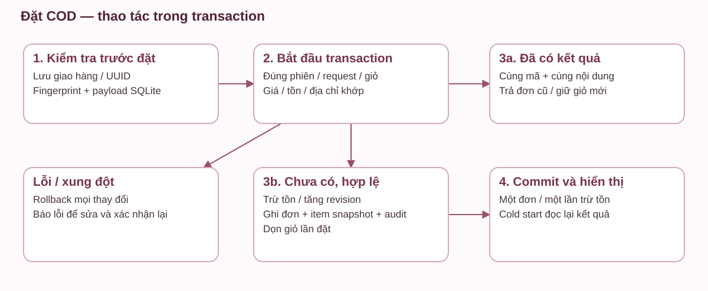
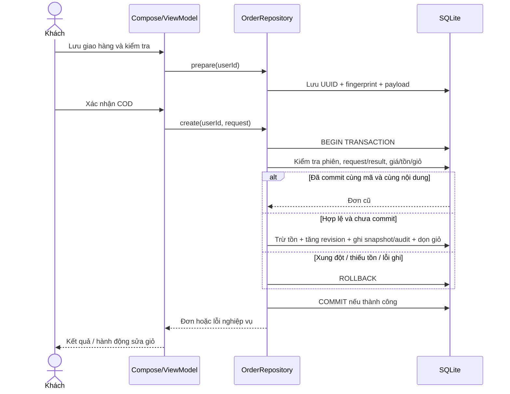
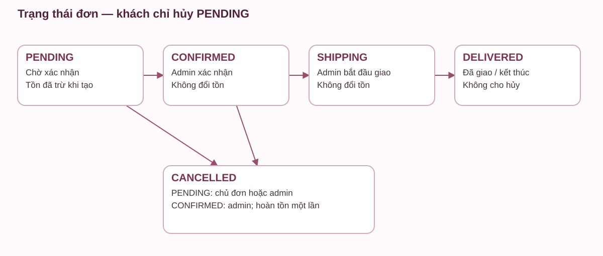
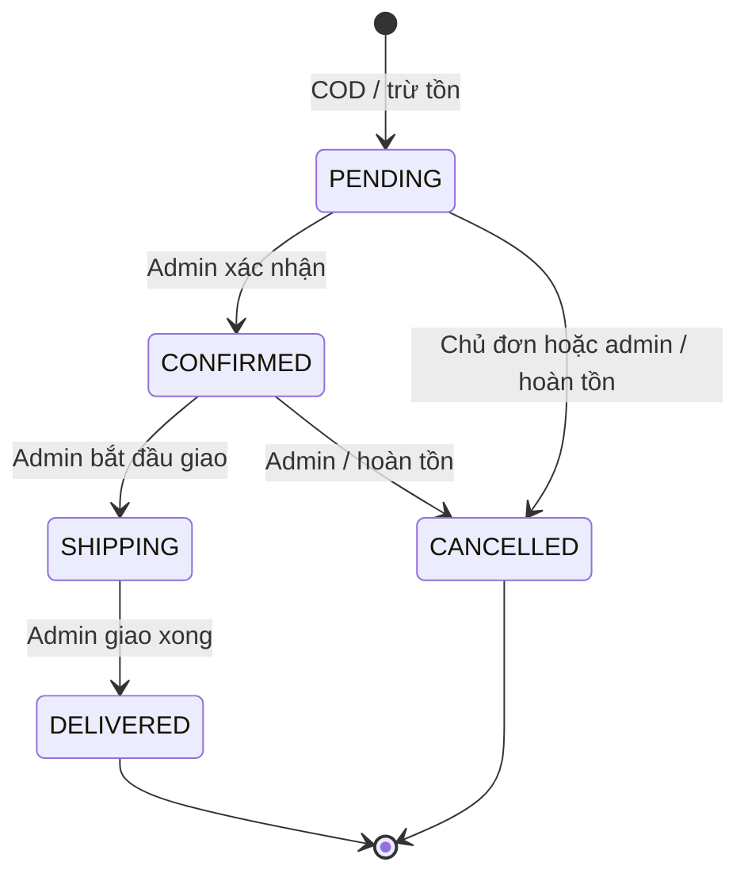

# Sơ đồ triển khai thực tế — SQLite schema 5

Các sơ đồ mô tả bản một thiết bị. Tác nhân khách/admin lần lượt dùng auth_session; không có server hay Firebase trong mã đang chạy. Có SVG ngoại tuyến kèm từng sơ đồ để in/xem không cần thư viện Mermaid.

## 1. Use case

## 2. Kiến trúc

AuthViewModel sở hữu ViewModelStore của phiên; store giữ qua cấu hình và xóa sau đăng xuất thành công. Repository dùng Dispatchers.IO và transaction. Biểu mẫu hồ sơ không tự tải đè khi resume.

## 3. Quan hệ dữ liệu

`orders.request_id` liên hệ logic với request đã tạo; không khai báo FK tới checkout_requests vì yêu cầu có thể được acknowledge/xóa sau khi khách xem kết quả. `order_items.product_id` có FK tới products nhưng tên/giá/dung tích/ảnh lưu snapshot. SVG chỉ vẽ các đường chính cho dễ đọc; Mermaid trên liệt kê cả quan hệ phụ.

## 4. Trình tự đặt COD

Không tra kết quả bằng mạng; khôi phục dùng request đã lưu trên cùng database. Replay thành công không dọn giỏ vừa thêm lần nữa.

## 5. Hủy và trạng thái

Hủy kiểm tra phiên, quyền sở hữu/vai trò và trạng thái trong transaction; cập nhật trạng thái có điều kiện, hoàn tồn từng dòng, tăng revision và ghi audit. Gửi lại hủy đã thành công không hoàn tồn lần hai. Khi lỗi ghi lịch sử hoặc tràn tồn, rollback cả trạng thái và tồn. Khách không hủy CONFIRMED/SHIPPING/DELIVERED.
